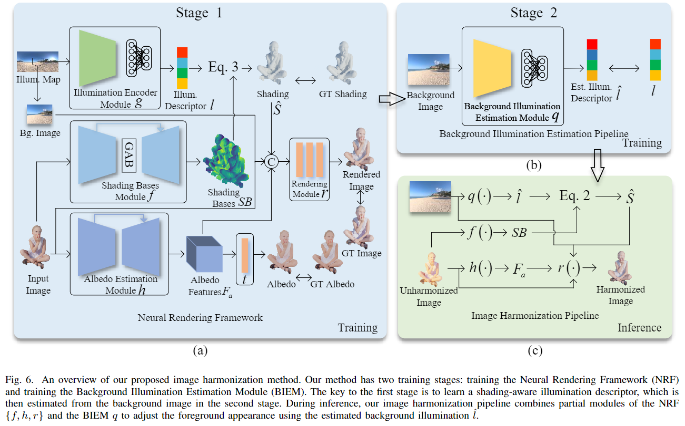

# SIDNet
Code for SIDNet: Learning Shading-aware Illumination Descriptor for Image Harmonization (IEEE TETCI 2023).

## [Project page](https://waldenlakes.github.io/IllumHarmony/) | [Dataset](https://github.com/waldenlakes/IllumHarmony-Dataset) | [Code](https://github.com/waldenlakes/SIDNet) | [Paper](https://arxiv.org/abs/2112.01314)

## Method Overview
We present a novel deep learning-based image harmonization method that uses background illumination to adjust the foreground appearance in brightness, color, and shading. An overview of our proposed image harmonization pipeline and its two trainging stages are shown in the figure below. Refer to [our paper](https://arxiv.org/pdf/2112.01314.pdf) for more details on SIDNet.



Our harmonized results:


## Dependencies and Installation
This code requires [PyTorch 1.7+](https://pytorch.org/) and [python 3+](https://www.python.org/downloads/). Also, please install other dependencies by

    pip install -r requirements.txt

## Data Preparation
Our SIDNet is trained and tested on the [IllumHarmony-Dataset](https://github.com/waldenlakes/IllumHarmony-Dataset). Please download it and put it in the folder [./datasets](./datasets).

## Training

Train our SIDNet on the IllumHarmony train set. Our training has two stages.

### Training Stage 1
To improve the generalization ability of the Albedo Estimation Module (AEM), we use data augmentation techniques (such as cropping and rotation) when training AEM. Therefore, in training stage 1, we divide neural rendering framework into two parts and train them separately. Note that these two parts can be trained simultaneously to reduce time cost.

Set a config file in configs/config_train_stage1_iem_and_sbm.json (e.g., set the train data path and GPU ID), and run as following:

    python train_stage1_iem_and_sbm.py

Set a config file in configs/config_train_stage1_aem_and_rm.json, and run as following:

    python train_stage1_aem_and_rm.py

### Training Stage 2
Once you have finished training stage 1, you can train the background illumination estimation module using pretrained models in training stage 1.

Set a config file in configs/config_train_stage2_biem.json, and run as following:

    python train_stage2_biem.py

## Testing

Test our pretrained SIDNet on the IllumHarmony test set. 

You should set a config file in configs/config_test.json, and run as following:

    python test.py

Before running the above script, you need to download the [pretrained models](https://drive.google.com/file/d/135b9fQ5HJikR12qGZ2wIYpuIkKYRGjFU/view?usp=sharing) and put them in the folder [./pretrained_models](./pretrained_models). 

We also provided test results, and you can download them from [OneDrive](https://mailnwpueducn-my.sharepoint.com/:u:/g/personal/zy_h_mail_nwpu_edu_cn/ESKWVdjZxbpAvkcqRtfWDfkBzIR0q2f-9WT3tOKp1u8sPQ?e=BJo9aU) or [BaiduCloud](https://pan.baidu.com/s/1ScNrOja8GLmM_Qor948oqA?pwd=whe0).

## Citation

If you use this code or these models in your research, please cite:

```
@article{hu2024sidnet,
  title={{SIDNet}: Learning Shading-Aware Illumination Descriptor for Image Harmonization},
  author={Hu, Zhongyun and Nsampi, Ntumba Elie and Wang, Xue and Wang, Qing},
  journal={IEEE Transactions on Emerging Topics in Computational Intelligence}, 
  year={2024},
  volume={8},
  number={2},
  pages={1290-1302}
}
```

## Contact
If you have any questions, please contact <zy_h@mail.nwpu.edu.cn>.
